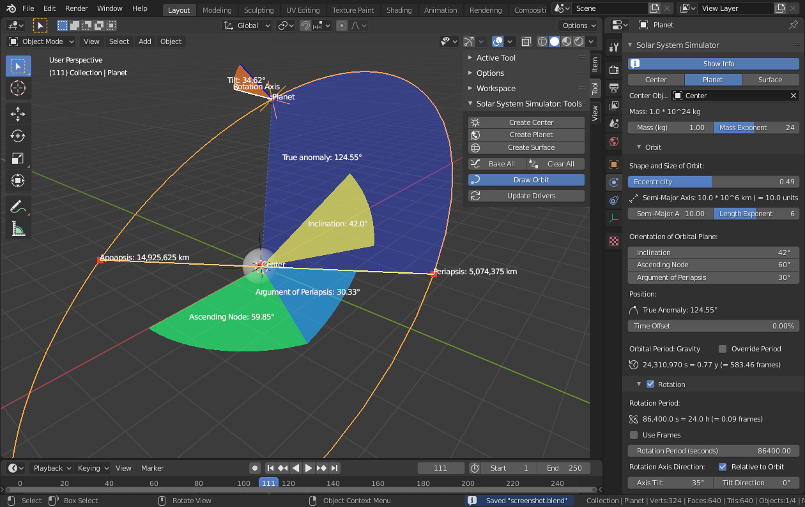

# SolarSystemSimulator - A Blender Add-on for simulating solar systems

[Blender](http://www.blender.org) is a free and open source 3D computer graphics software toolset.
This Add-on provides some tools to create a solar system in Blender (one central sun with several orbiting planets, possibly with further orbiting moons).
The orbits are specified by setting the appropriate [orbital elements](https://en.wikipedia.org/wiki/Orbital_elements).
Kepler's laws are used to simulate the motion along the orbits (i.e. orbits are the ellipses that you get from solving the 2-body problem exactly).
The calculated motion is applied to the planets via drivers (see Blender's animation system), but can also be permanently fixed ("baked") into the .blend file.
I posted the files on [blenderartists](https://blenderartists.org/), you can find the discussion thread at <https://blenderartists.org/t/solar-system-simulator/553099>.

In the summer of 2012 I had some free weeks where I wanted to learn (more) Python.
I had some experience with Blender and its scripting capability.
So I decided to write an Add-on.
It was fun.
I learned a lot.
My first big programming project (that I completed).
However after most of the features were implemented, I lost interest.
Occasionally Blender's API changed and I needed to fix things that broke.
But I don't want to maintain this Add-on until the end of time.

So if you, dear reader, find some use for this, then feel free to clone this repository and do whatever you want with it (note the license: [GPLv2](./LICENSE)).
Oh, I think that [NOTES](./NOTES.txt) is a short summary of all the properties adjustable via the user interface.
Also some of my code might be crap, but this is your problem now :P.

Markus Ebke, 2018-10-04

# Changelog (incomplete)

**0.7 (2020-07-03)**
- Update for new Blender 2.80 API
- Adjust UI
- Update forum post, screenshots and blend-files

**0.8 (2023-05-13)**
- Fixed minor bugs in the layout and display
- When overriding the orbital or rotation period with a period in frames, the period in seconds did not correct for the scene fps
- When drawing the orbit, the true anomaly text now accounts for sssim_orbit.time_offset
- Checked Add-on with newest Blender version 3.5
